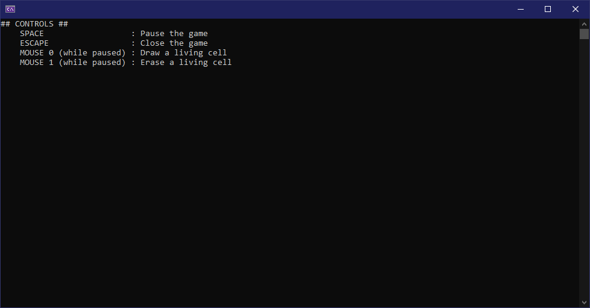
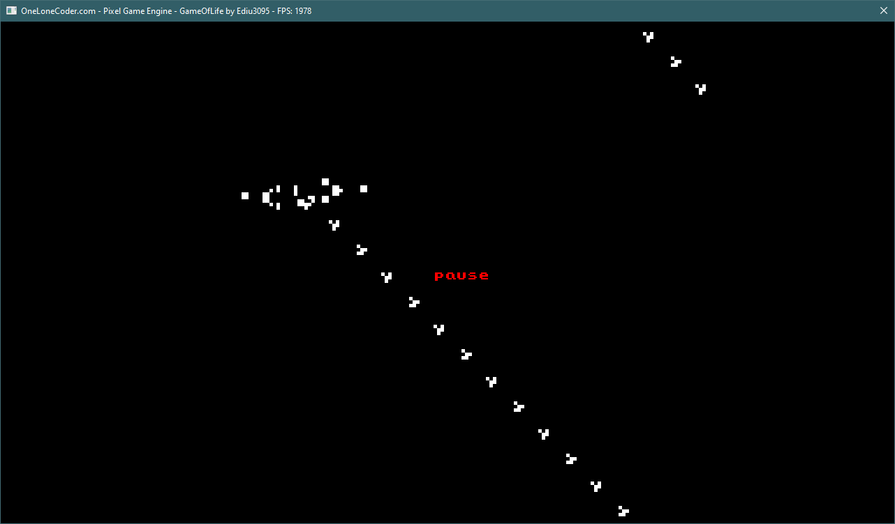

# GameOfLife

This is an implementation of John Conway's Game of Life made with CUDA and OneLoneCoder's olcPixelGameEngine.

## Implementation details

The world map is represented through the use of two boolean arrays where each position of the array represents a specific cell. This means that, instead of having an infinite grid of cells the grid is finite. Not only that but the grid is wrapped both horizontally and vertically. This means that the world map is the surface of a toroid.

In order to update the grid, a kernel has been written. The kernel is executed for every cell and it counts the amount of neighbours of each cell before deciding its fate.

The olcPixelGameEngine is used to display the grid in a window. This window can be controlled to an extent using the mouse and keyboard. The list of actions which can be executed through user input are:

- SPACE : Pause the game
- ESCAPE : Close the game
- MOUSE 0 (while paused) : Draw a living cell
- MOUSE 1 (while paused) : Erase a living cell

## Screenshots

